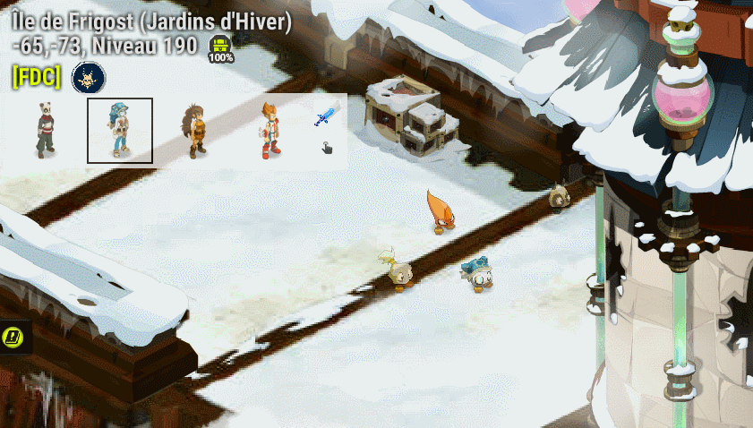
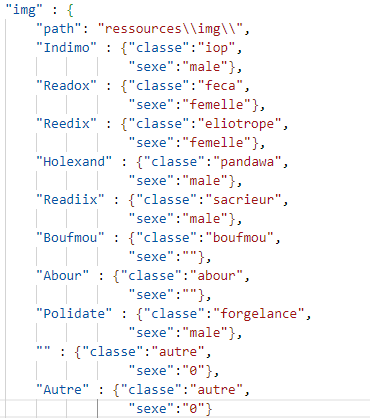
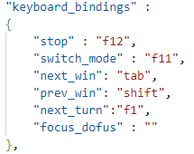
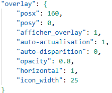

# Dofus Overlay - Dofus Tools

## Aide à la gestion du multi-comptes sur dofus

Cet overlay permet de mieux gérer son changement de page lors d'une session de jeu dofus en multi-compte.

Le code sera disponible prochaine avec un .exe pour ceux qui n'ont pas l'habitude d'utiliser python.

Je vous invite toute fois à rester vigilent et à ne pas oublier que les logiciels tiers peuvent représenter un menace pour votre ordinateur ou vos comptes Ankama. Vous pourrez donc regarder le code pour vérifier qu'aucune instruction malveillante s'y trouve. Je vous invite également à ne pas télécharger Dofus Overlay sur un autre site qui pourrait redistribuer l'application après l'avoir modifier.
Cette nouvelle version de l'overlay est une copie du organizer de dofusguide avec quelques améliorations et correction. Je vous invite à vous diriger vers leur application si vous préférez ne pas prendre le risque de faire confiance à un inconnu sur github (moi). 

## Installation:

- Téléchargez dofusOverlay.zip de la dernière release située à droite : [Release v3.0](https://github.com/Readix1/dofusOverlay_OpenSource/releases/tag/v3.0)
- Dézipez le dossier
- Exécutez dofusOverlay.exe (il est possible que le logiciel ne soit pas reconnu par windows et que cela demande une autorisation)

## Fonctionnalités: 
#### Toutes les fonctionnalités doivent respecter les CGU. Actuellement la seule fonctionnalité (macro click + tab sur la souris) est autorisée. [Lien forum dofus](https://www.dofus.com/fr/forum/1069-dofus/2404061-macros-autorise?page=2#entry13291455)

- appuyer sur tab (+shift) permet de passer à la page dofus suivante (précédente) (paramétrable dans le fichier ressources/config.json [option: next_win, prev_win]ou dans le menu déroulant pendant l'exécution) 
- ne plus avoir le focus sur une page dofus fait disparaitre l'overlay (option: auto-disparition)
- clicker sur une image de l'overlay permet de changer de page dofus
- drag l'overlay permet de le déplacer
- Macro click + page suivante (equivalent à click+tab) (macro_clic_next_win)
- ctrl+click sur un personnage de l'overlay pour le sélectionner/désélectionner (Les personnages désélectionnés ne sont plus éligibles à l'affichage via tab)
- Appuyer sur f11 pour reorganiser les pages (option: reorganizer)
- Appuyer sur f13 pour focus sur la page dofus dernièrement selectionnée (option: focus_dofus)
- Actualisation manuelle via f4 pour éviter une boucle infini (option: actualise, auto-actualisation)
- Possibilité de mettre l'overlay à la verticale ou à l'horizontale (option: horizontal)
- Save les informations comme l'ordre ou les images.

## Configurations:
Dans le fichier ressources/config.json, il est possible de faire quelques modifications pour personnaliser l'overlay
- il est possible de changer l'image associée à chaque personnage.
Pour cela il faut cliquer sur la flèche lors de l'exécution puis sur le visage pour sélectionner une nouvelle icon ou ajouter une image dans ressource puis configurer le path dans information.json

- il est possible de changer l'assignation des touches pour certaines options

- quelques autres modification comme la position de l'overlay et son opacité /!\ pas encore géré pour le nouvel overlay

## Bugs
- 

## A ajouter:
- 

## Bugs résolus
- 

## Feature ajoutée 
- Macro click + tab

Toutes images de personnage de [Dofus](https://www.dofus.com/fr/prehome) sont la propriété d'[Ankama](https://www.ankama.com/fr)
