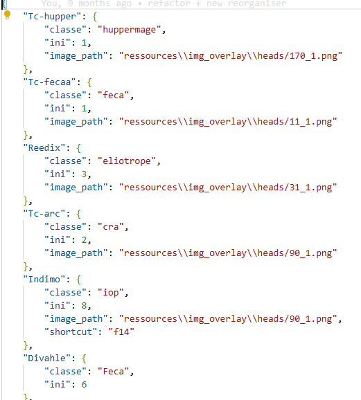

# Dofus Overlay - Dofus Tools

## Aide à la gestion du multi-comptes sur dofus

Cet overlay permet de mieux gérer son changement de page lors d'une session de jeu dofus en multi-compte.

Le code sera disponible prochaine avec un .exe pour ceux qui n'ont pas l'habitude d'utiliser python.

Je vous invite toute fois à rester vigilent et à ne pas oublier que les logiciels tiers peuvent représenter un menace pour votre ordinateur ou vos comptes Ankama. Vous pourrez donc regarder le code pour vérifier qu'aucune instruction malveillante s'y trouve. Je vous invite également à ne pas télécharger Dofus Overlay sur un autre site qui pourrait redistribuer l'application après l'avoir modifier.

## Fonctionnalités: 
#### Toutes les fonctionnalités doivent respecter les CGU. Actuellement la seule fonctionnalité (macro click + tab sur la souris) est autorisée. [Lien forum dofus](https://www.dofus.com/fr/forum/1069-dofus/2404061-macros-autorise?page=2#entry13291455)

- appuyer sur tab (+shift) permet de changer de page dofus ouverte
- ne plus avoir le focus sur une page dofus fait disparaitre l'overlay
- clicker sur une image de l'overlay permet de changer de page dofus (bug)
- drag l'overlay permet de le déplacer
- click sur les boutons du coté de la souris pour click sur la page dofus + changer de page dofus (anciennement mode épée/mode "doigt")
- ctrl+click sur un personnage de l'overlay pour le sélectionner/désélectionner (Les personnages désélectionnés ne sont plus éligibles à l'affichage via tab)

## Configurations:
Dans le fichier ressources/config.json, il est possible de faire quelques modifications pour personnaliser l'overlay
- il est possible de changer l'image associée à chaque personnage.
Pour cela il faut ajouter une ligne dans le dictionnaire de la forme "« nom »":{"classe":«classe», "sexe":«sexe»}

- il est possible de changer l'assignation des touches pour certaines options

- quelques autres modification comme la position de l'overlay et son opacité

## Bugs
- quand on utilise le click sur l'overlay pour changer de page, il arrive que ça crash

## A ajouter:
- un mode cbt qui permet de pouvoir réorganiser l'ordre des perso sur l'overlay et le mode normal pour clicker sur l'overlay pour faire apparaitre la page

## Bugs résolus
- quand on ne click pas sur les images de personnage, l'overlay peut disparaitre

## Feature ajoutée 
