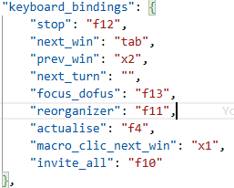

# Dofus Overlay - Dofus Tools

## Aide à la gestion du multi-comptes sur dofus

Cet overlay permet de mieux gérer son changement de page lors d'une session de jeu dofus en multi-compte.

## Fonctionnalités: 
- appuyer sur tab (+shift) permet de changer de page dofus ouverte
- ne plus avoir le focus sur une page dofus fait disparaitre l'overlay
- clicker sur une image de l'overlay permet de changer de page dofus (bug)
- drag l'overlay permet de le déplacer

## Configurations:
Dans le fichier ressources/config.json, il est possible de faire quelques modifications pour personnaliser l'overlay
- il est possible de changer l'image associée à chaque personnage.
Pour cela il faut ajouter une ligne dans le dictionnaire de la forme "« nom »":{"classe":«classe», "sexe":«sexe»}

- il est possible de changer l'assignation des touches pour certaines options

- quelques autres modification comme la position de l'overlay et son opacité

## Bugs
- quand on utilise le click sur l'overlay pour changer de page, il arrive que ça crash
- quand on ne click pas sur les images de personnage, l'overlay peut disparaitre

## A ajouter:

## Bugs résolus

## Feature ajoutée 
